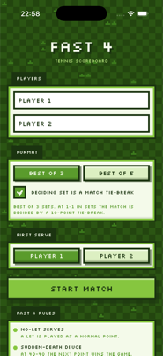
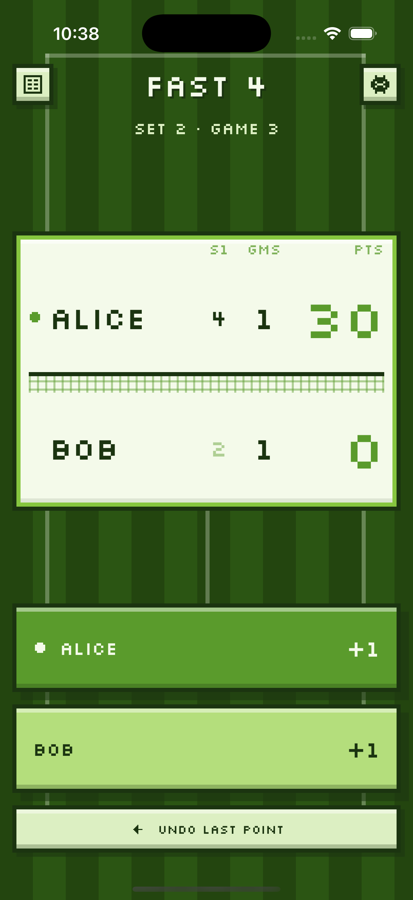
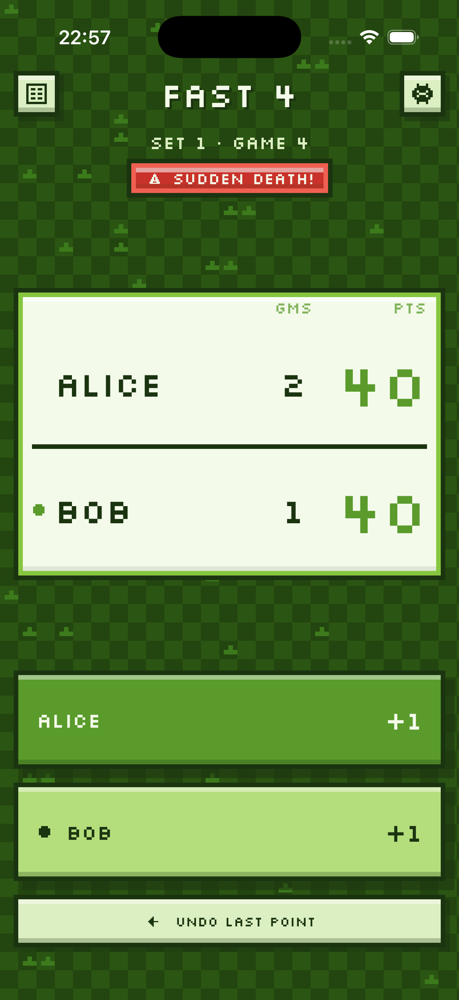
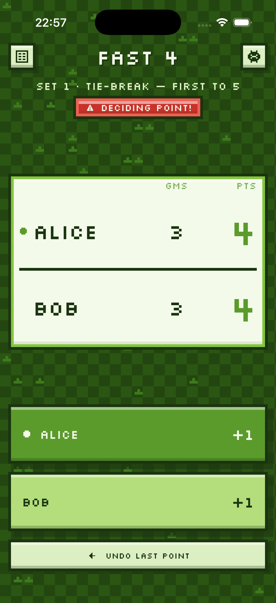

# Fast4

An iOS scoreboard for Fast4 tennis, dressed as a 16-bit farming game. Two big
buttons, an undo button, and the format handled for you.

Open `Fast4.xcodeproj` in Xcode and run. iOS 17+, iPhone and iPad.

| Home | Scoreboard |
| :--: | :--: |
|  |  |
| Choose players, format and first serve | Sets, games and points, with a ball marking the server |
| **Sudden death** | **Deciding point** |
|  |  |
| At 40-40 the next point takes the game | At 4-4 in a tie-break, the next point takes the set |

Every point is one tap; the undo button rewinds any mistake, including one that
closed out a game or a set. The deciding-point banner is the only red in the
app — it appears at 40-40, at 4-4 in a set tie-break, and at 9-9 in a match
tie-break.

## The format it implements

| Rule | Behaviour |
| --- | --- |
| Sudden-death deuce | At 40-40 the next point takes the game — no advantage |
| Short sets | First to 4 games wins the set |
| Set tie-break | At 3-3, a tie-break to 5; deciding point at 4-4; the set is recorded 4-3 |
| Match tie-break | Optionally, a deciding set (1-1 or 2-2) is a tie-break to 10; deciding point at 9-9 |
| No-let serves | Nothing to implement — a let is simply played as a normal point |

Serving alternates each game, and follows the one-point-then-two pattern inside
a tie-break; after a tie-break, whoever served it first receives first in the
next set.

## How it's put together

- `Fast4/Model/MatchState.swift` — the scoring engine. Only `config` and
  `pointLog` are authoritative; every other value is derived by replaying the
  log. Undo is therefore just "drop the last point and replay", which cannot
  leave the state inconsistent.
- `Fast4/Model/MatchStore.swift` — owns the live match and mirrors it into
  `UserDefaults` after every point, so quitting mid-match loses nothing.
- `Fast4/Views/PixelKit.swift` — the pixel-art design system: palette, font,
  the checkerboard field, chunky panels, beveled buttons that drop onto their
  own shadow, hand-plotted icons, and an in-idiom modal (a system action sheet
  in the middle of a pixel game looks like a bug).
- `Fast4/Views/` — setup screen, scoreboard, point-by-point history.

### Look

White and shades of green, everything on a 4pt grid with square corners.

The font is **Silkscreen** (SIL Open Font License, `Fast4/Resources/`),
registered at launch with Core Text so no hand-written `Info.plist` is needed.
It was chosen the hard way: softer pixel faces that suited the theme better
render `5` almost identically to `S` and `B` almost identically to `G`, which is
fatal on a scoreboard. Only the regular weight ships — Silkscreen Bold closes
the counter of `4` so it reads as a solid blob, and this app is full of fours.
Emphasis comes from size and colour instead.

The app icon is generated, not drawn by hand:

```sh
swiftc -O Tools/MakeIcon/main.swift -o /tmp/makeicon
/tmp/makeicon Fast4/Assets.xcassets/AppIcon.appiconset/icon-1024.png
```

It plots a 32×32 sprite with antialiasing off, then upscales with
nearest-neighbour interpolation, so the result is true pixel art rather than a
smooth vector shrunk down.

## Tests

The engine has no UIKit dependency, so it is tested by a standalone harness
rather than an Xcode test target:

```sh
swiftc -O Fast4/Model/Player.swift Fast4/Model/MatchConfig.swift \
          Fast4/Model/MatchState.swift EngineTests/main.swift -o /tmp/enginetests
/tmp/enginetests
```

It covers each rule above plus serving rotation, undo across game/set/match
boundaries, encode-decode round trips, and ~200k assertions swept over 400
randomised matches (no set ever reaches 4-4, every set is won 4-x, a 4-3 set
always came from a tie-break, and every match terminates).

## Licence

The code is MIT licensed — see [LICENSE](LICENSE).

The bundled font is not covered by that licence. Silkscreen is licensed
separately under the SIL Open Font License, and its terms are included at
`Fast4/Resources/Silkscreen-OFL.txt`; that file must travel with the `.ttf` in
any redistribution.
